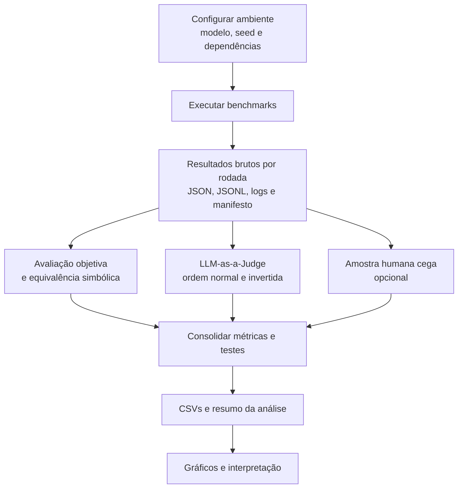

# Relatório do fluxo completo de avaliação

## Objetivo

O projeto compara estratégias de prompting aplicadas a um Small Language Model (SLM) executado localmente pelo Ollama. O objetivo é medir não apenas qual estratégia acerta mais, mas também seu custo, estabilidade e confiabilidade de avaliação.

O protocolo principal avalia as mesmas instâncias com quatro abordagens:

| Abordagem | O que faz |
| --- | --- |
| `base` | Solicita uma resposta direta, sem uma estrutura explícita de raciocínio. |
| `cot` | Solicita um raciocínio conciso antes da resposta final (*Chain of Thought*). |
| `for` | Organiza o raciocínio em quatro fases: decomposição, mapeamento de conhecimento, execução e auditoria (*Flow of Reasoning*). |
| `gflow` | Produz três trajetórias independentes e seleciona uma resposta por consenso, sem consultar o gabarito. |

Os prompts estão centralizados em `prompts_central.py`. Isso mantém as instruções versionáveis e permite alterar uma estratégia sem misturar esse ajuste com a lógica de execução ou avaliação.

## Visão geral



## 1. Preparação e reprodutibilidade

Antes da execução, são instaladas as dependências do `requirements.txt`, o servidor Ollama deve estar ativo e o modelo alvo deve estar disponível localmente. O modelo é escolhido por `SLM_MODEL_NAME`; a amostragem e os procedimentos estatísticos usam `EXPERIMENT_SEED`, cujo valor padrão é `20260612`.

Os experimentos usam temperatura `0.0` e `top_p` `0.9`, reduzindo a variação de geração. A concorrência é limitada a oito tarefas/chamadas simultâneas para equilibrar velocidade e disponibilidade do servidor local.

Cada rodada cria um diretório próprio e registra:

- respostas consolidadas em JSON;
- respostas parciais em JSONL, para recuperação de execuções longas;
- log textual da execução;
- manifesto com seed, IDs amostrados, hashes dos prompts, versões de dependências, dados do ambiente e do modelo;
- telemetria de duração e tokens, quando fornecida pelo provedor.

## 2. Benchmarks executados

O protocolo principal coleta 100 instâncias por domínio, totalizando 400 instâncias antes de considerar as quatro abordagens.

| Script | Benchmark | Tipo de problema | Papel do `gflow` |
| --- | --- | --- | --- |
| `experimento_gsm8k_arc.py` | GSM8K e ARC-Challenge | problemas matemáticos e múltipla escolha | formal, heurístico e contraprova |
| `experimento_hendrycks_math.py` | Hendrycks MATH/AIME | matemática simbólica e problemas avançados | algébrico, heurístico e análise de casos |
| `experimento_truthfulqa.py` | TruthfulQA | veracidade, mitos e premissas falsas | factual, cético e incerteza calibrada |

`experimento_math_avancado.py` é uma arena adicional para matemática, com prompts mais fortes. Ele é opcional e não deve ser somado automaticamente ao conjunto principal de 400 instâncias.

## 3. Geração das respostas

Para cada pergunta selecionada, o mesmo modelo recebe um prompt de sistema correspondente à abordagem. Todas as estratégias devem encerrar a resposta com:

```text
RESPOSTA_FINAL: <resposta final curta>
```

Esse marcador permite extrair a resposta que será comparada ao gabarito, mesmo quando o modelo também produz explicações.

### Fluxo específico da estratégia GFlow

O `gflow` não é uma GFlowNet treinada: é uma estratégia de orquestração inspirada em múltiplas trajetórias. Para uma única pergunta:

1. são chamadas três trajetórias com papéis complementares;
2. cada trajetória gera uma resposta final no mesmo formato padronizado;
3. as respostas finais são normalizadas;
4. a resposta oficial é definida por voto de consenso; em empate, aplica-se uma prioridade determinística;
5. os textos de cada trajetória e a decisão de seleção são preservados no resultado.

O gabarito, o juiz externo e as respostas de referência não participam dessa seleção. Portanto, a métrica oficial de `gflow` mede a resposta que o método realmente teria disponível em produção.

## 4. Persistência dos resultados brutos

Cada registro de geração contém, entre outros campos, o identificador da instância, dataset, modelo, pergunta, gabarito, abordagem, resposta completa, duração, status e telemetria. Para `gflow`, também contém `rastros_execucao` e `selecao_gflow`.

Esses resultados são a fonte de verdade das etapas posteriores. A análise não precisa executar novamente o SLM; ela lê os JSONs/JSONLs produzidos nas rodadas.

## 5. Avaliação das respostas

### Avaliação determinística

`processar_resultados.py` normaliza as respostas e calcula métricas objetivas diretamente contra o gabarito. Dependendo do domínio, isso inclui:

- `Exact Match`;
- `Answer Match`;
- equivalência simbólica para respostas matemáticas;
- `Truthfulness` e `Informativeness` em TruthfulQA.

### LLM-as-a-Judge

`avaliar_llm_judge.py` agrupa as quatro respostas da mesma instância e solicita uma avaliação comparativa a um modelo juiz separado do SLM avaliado. O juiz recebe a pergunta, a referência e as respostas de cada abordagem, e devolve JSON estruturado com veredito, pontuação, justificativa, tipo de erro, confiança, ranking e medidas específicas de TruthfulQA.

A ordem das abordagens é embaralhada e o julgamento é repetido com a ordem invertida. A diferença entre os dois vereditos permite estimar o viés posicional do juiz. Opcionalmente, uma parcela da amostra pode ser enviada a um segundo juiz.

No caso de `gflow`, o juiz avalia oficialmente apenas a resposta selecionada por consenso. As três trajetórias são avaliadas separadamente apenas no diagnóstico `Oracle@3`.

### Avaliação humana opcional

`gerar_amostra_avaliacao_humana.py` cria uma amostra estratificada e embaralha as respostas. O avaliador humano preenche o CSV sem consultar a chave de associação. Depois, `processar_resultados.py` incorpora os vereditos humanos e calcula concordância com os juízes.

## 6. Consolidação e métricas

`processar_resultados.py` une os resultados brutos, as avaliações do juiz e, quando disponíveis, as avaliações humanas. São produzidos CSVs por abordagem, dataset e combinação modelo/dataset/abordagem.

As análises incluem:

| Grupo | Medidas |
| --- | --- |
| Qualidade da resposta | Exact Match, Answer Match, equivalência simbólica, Truthfulness e Informativeness. |
| Comparação com a base | delta de acurácia, Win/Tie/Loss, McNemar exato e correção de Holm. |
| Incerteza estatística | intervalos de confiança por bootstrap. |
| Multi-trajetória | `Oracle@3`, que indica se ao menos uma trajetória do `gflow` seria correta. Não substitui o resultado oficial. |
| Confiabilidade da avaliação | Agreement, Cohen's Kappa e Position Bias Rate. |
| Eficiência | duração média, Accuracy per Second e Gain per Extra Call. |

O processamento gera, entre outros, `respostas_normalizadas.csv`, `metricas_por_abordagem.csv`, `metricas_por_dataset_abordagem.csv`, `win_tie_loss_vs_baseline.csv`, `auditoria_position_bias.csv`, `concordancia_avaliadores.csv`, `metricas_truthfulqa.csv`, `metricas_gflow_oracle.csv` e `resumo_geral.json`.

## 7. Visualização e interpretação

`gerar_graficos_resultados.py` lê o diretório de análise e cria gráficos de acurácia, tempo médio, acurácia por dataset, delta contra a base, custo versus acurácia, `Oracle@3`, eficiência, Win/Tie/Loss e viés posicional. Quando a biblioteca de gráficos não estiver disponível, o script possui saída alternativa em SVG.

Ao interpretar os resultados, a ordem recomendada é:

1. verificar se as quatro abordagens foram executadas sobre a mesma amostra;
2. observar a métrica compatível com cada dataset, não somente uma acurácia agregada;
3. comparar o ganho contra `base` com o intervalo de confiança e McNemar;
4. verificar custo e duração, sobretudo no `gflow`, que realiza três chamadas por pergunta;
5. conferir `Oracle@3` como teto diagnóstico, sem confundi-lo com a performance oficial;
6. checar concordância humana, segundo juiz e taxa de viés posicional antes de tirar conclusões fortes.

## 8. Ordem prática de execução

1. Executar os três scripts do protocolo principal.
2. Executar a arena matemática avançada somente se ela fizer parte da análise desejada.
3. Rodar o LLM-juiz sobre os diretórios de resultados.
4. Gerar e preencher a amostra humana, se aplicável.
5. Consolidar os resultados com `processar_resultados.py`.
6. Gerar gráficos a partir da rodada criada em `analises_resultados`.

Os comandos concretos e as variáveis de ambiente estão documentados em `EXECUCAO_EXPERIMENTO.md`.

## Limites e cuidados metodológicos

- O juiz deve ser diferente e, idealmente, mais capaz que o SLM avaliado.
- Falhas do juiz são registradas separadamente; não devem ser tratadas automaticamente como erros do SLM.
- `Oracle@3` responde a uma pergunta diagnóstica (“alguma trajetória acertou?”), enquanto o veredito oficial responde à pergunta de uso real (“a seleção do método acertou?”).
- A arena avançada é uma variante experimental e precisa ser reportada separadamente do protocolo principal.
- Para comparar rodadas ou modelos diferentes, o modelo faz parte das chaves de agrupamento, evitando misturar resultados de SLMs distintos.
